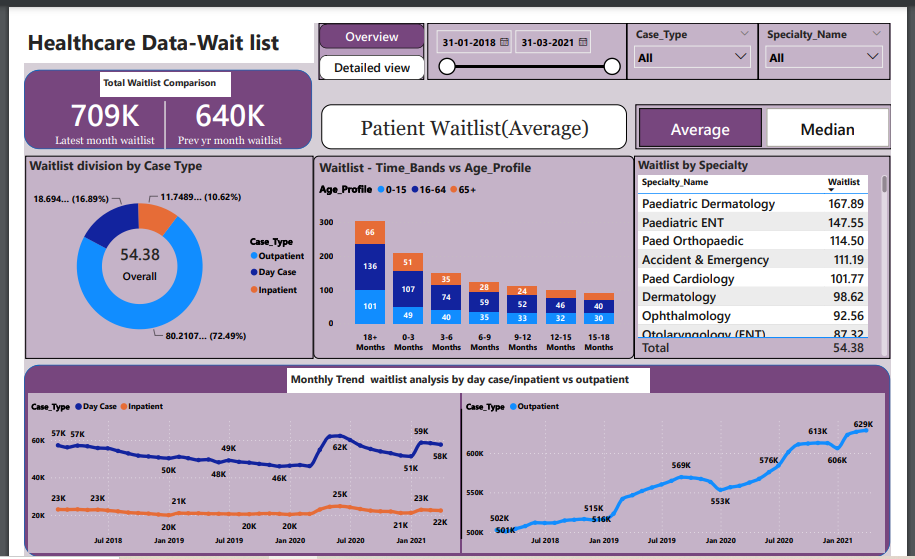

#### [Linkedin](https://www.linkedin.com/in/manisha-das-3a7b3b224/)
# Projects:
## [ATM Transaction Dashboard](https://github.com/manisha23das/ATM-Transaction-Dashboard)
The purpose of this project is to analyze the ATM transaction data for Bank to gain insights on customer behavior, ATM usage, and identify opportunities to improve the bank's services. 
## [Healthcare Data Wait List Dashboard](https://github.com/manisha23das/Healthcare-Data-Wait-List-Dashboard)
This project focuses on creating an insightful and interactive dashboard using Power BI to analyze and visualize healthcare wait list data. The dataset utilized includes information on inpatient and outpatient cases, organized in a CSV file. 
## [Sales Dashboard](https://github.com/manisha23das/Sales-Dashboard)
The Sales Dashboard project focuses on providing a comprehensive visual representation of sales data. Through key metrics and interactive visualizations, the dashboard aims to empower businesses with insights into sales performance, trends, and areas for improvement. 
## [HR Attrition Analytics](https://github.com/manisha23das/HR-Analytics)
The HR Attrition Analytics Project is a comprehensive data analytics initiative aimed at analyzing and visualizing employee attrition data for informed decision-making within an organization. The goal is to provide valuable insights into employee attrition trends, enabling HR professionals to devise targeted retention strategies and optimize workforce planning. 
## [Pharma Data Analysis-MySql](https://github.com/manisha23das/Pharma-Data-Analysis--MYSQL)
The Pharma Dataset Data Analysis project aims to derive valuable insights from a pharmaceutical dataset using SQL queries. By leveraging SQL queries, this analysis focuses on uncovering patterns, trends, and key metrics within the pharmaceutical sales data.
# Certificates:
[• PWC Power BI Job Simulation on Forage](https://drive.google.com/file/d/1Yx8TWmV58tzk8MBMaNE925WjBigY8tg7/view)
-Completed a job simulation where I strengthened my PowerBI skills to better understand clients and their data visualisation needs.

[• SQL(Basic/Intermediate) - HackerRank](https://www.hackerrank.com/certificates/2f0d4694a423)
