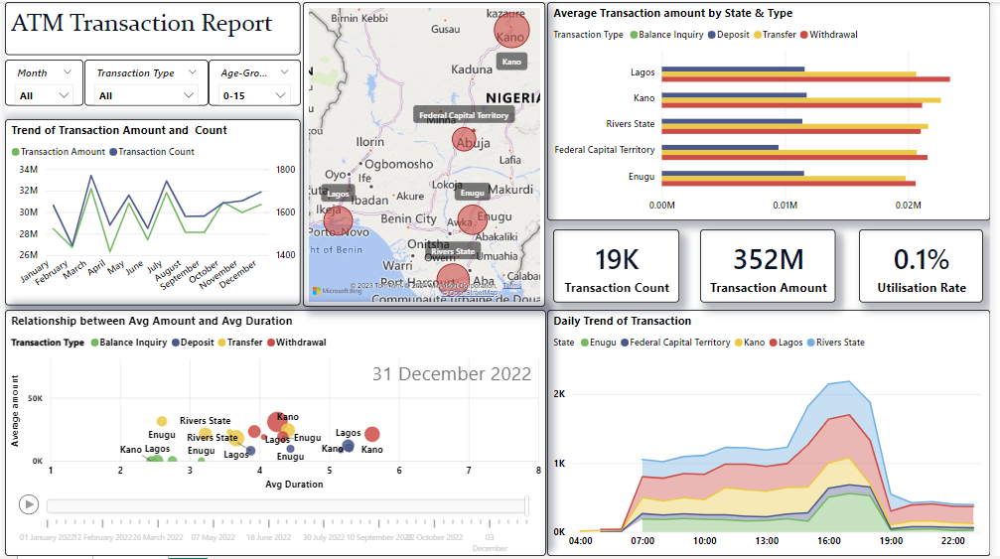
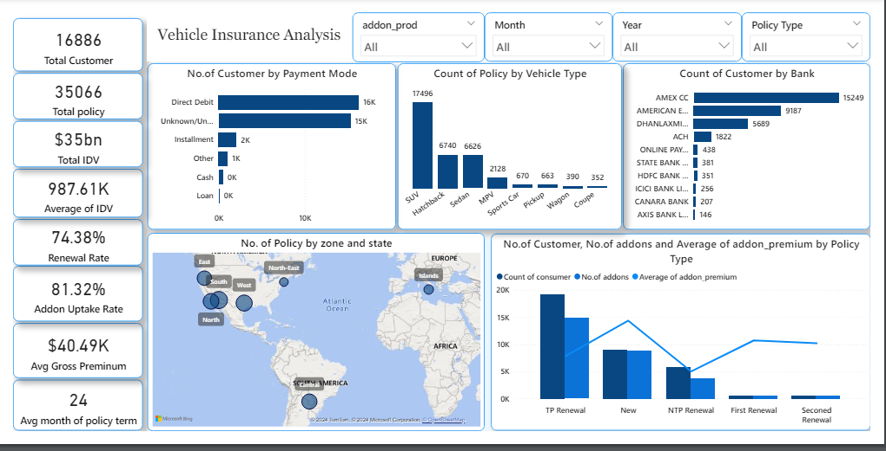
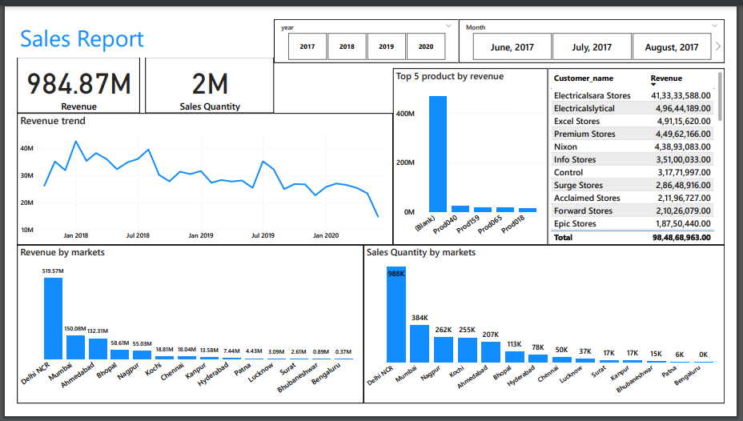
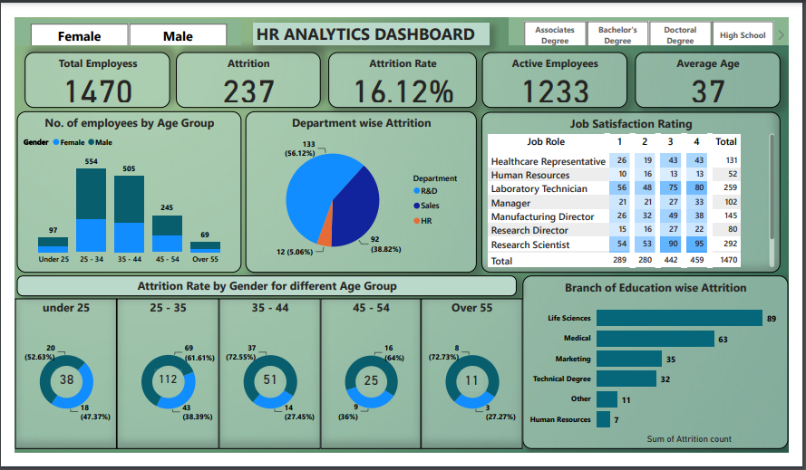

### -[Resume](https://drive.google.com/file/d/1oKBGIkFPy5c_WDGC3Vf1QcXtug4W7Dxh/view?usp=sharing)     
### -[Linkedin](https://www.linkedin.com/in/manisha-das-3a7b3b224/)
### -Contact: manisha.bhumca21@gmail.com

# Projects:
## [ATM Transaction Dashboard](https://github.com/manisha23das/ATM-Transaction-Dashboard)
The purpose of this project is to analyze the ATM transaction data for Bank to gain insights on customer behavior, ATM usage, and identify opportunities to improve the bank's services. 
## [Vehicle Car Insurance Analysis](https://github.com/manisha23das/Vehicle-Car-Insurance)
This project focuses on analyzing vehicle car insurance data using Power BI to uncover key insights and trends that can aid the insurance manager in making informed decisions. The analysis includes performance metrics, customer distribution, policy preferences, and regional sales contributions. 
## [Sales Dashboard](https://github.com/manisha23das/Sales-Dashboard)
The Sales Dashboard project focuses on providing a comprehensive visual representation of sales data. Through key metrics and interactive visualizations, the dashboard aims to empower businesses with insights into sales performance, trends, and areas for improvement. 
## [HR Attrition Analytics](https://github.com/manisha23das/HR-Analytics)
The HR Attrition Analytics Project is a comprehensive data analytics initiative aimed at analyzing and visualizing employee attrition data for informed decision-making within an organization. The goal is to provide valuable insights into employee attrition trends, enabling HR professionals to devise targeted retention strategies and optimize workforce planning. 
## [Pharma Data Analysis-MySql](https://github.com/manisha23das/Pharma-Data-Analysis--MYSQL)
The Pharma Dataset Data Analysis project aims to derive valuable insights from a pharmaceutical dataset using SQL queries. By leveraging SQL queries, this analysis focuses on uncovering patterns, trends, and key metrics within the pharmaceutical sales data.
## [Consumer Goods ad_hoc insights-Mysql](https://github.com/manisha23das/Consumer-goods-ad-hoc-request)
The objective of this project is to analyze various aspects of Atliq Hardwares' business operations based on ten specific ad-hoc requests. These insights will help the management understand market presence, product diversity, customer behavior, sales performance, and more.
## [Indian Census Analysis-MySql](https://github.com/manisha23das/India-Census-analysis--MySql/blob/main/india_census.sql)
The India Census Analysis project aims to derive meaningful insights from Indian census data using MySQL. Leveraging two datasets, Dataset1 and Dataset2, the project delves into demographic information, growth trends, literacy rates, and population statistics across various districts and states in India.
## [Bank Loan Analysis-Excel](https://github.com/manisha23das/Bank-Loan-Analysis-Excel/blob/main/Screenshot%203.png)
The Bank Loan Analysis project utilizes Excel, specifically employing pivot tables, to analyze and derive insights from a dataset of loan applications. The dataset includes information such as loan details, applicant details, and loan status.
# Certificates:
[• PWC Power BI Job Simulation on Forage](https://drive.google.com/file/d/1Yx8TWmV58tzk8MBMaNE925WjBigY8tg7/view)
-Completed a job simulation where I strengthened my PowerBI skills to better understand clients and their data visualisation needs.

[• SQL(Basic/Intermediate) - HackerRank](https://www.hackerrank.com/certificates/2f0d4694a423)
